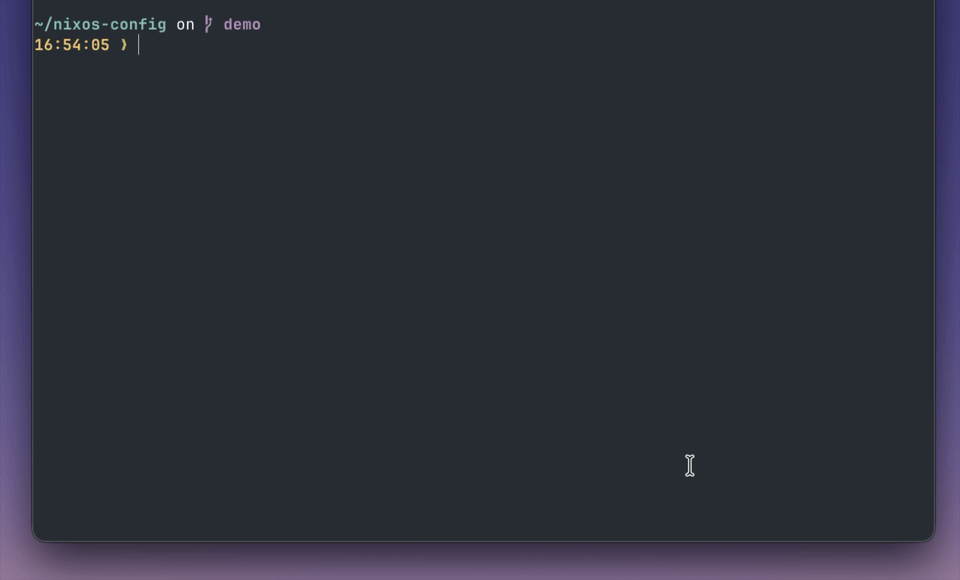

# flakectl

`flakectl` is a menu for your flake apps.

It gives you a gum-powered app picker (`nix run .#menu`) and ships with a useful default set of apps (`build`, `build-switch`, `rollback`, `push`, `update-flake`) so you can use it out of the box.

Under the hood, these are standard first-class flake apps (`apps.<system>.<name>`), so they work with normal `nix run` workflows.

Works with both nix-darwin and NixOS. Platform is auto-detected from your system type.



> **Note:** This project is built for multi-platform support, but has only been tested on darwin (macOS) so far. NixOS support is implemented but unverified. If you run into issues, please [open an issue](https://github.com/szympajka/flakectl/issues) or submit a PR.

## Credits

Built on top of [dustinlyons/nixos-config](https://github.com/dustinlyons/nixos-config). Dustin's project was instrumental in me falling in love with Nix. I started tweaking his app scripts to my liking, and that's how flakectl was born.

## Usage

Add to your `flake.nix`:

```nix
{
  inputs.flakectl.url = "github:szympajka/flakectl";

  outputs = inputs:
    inputs.flake-parts.lib.mkFlake { inherit inputs; } {
      systems = [ "aarch64-darwin" ];
      imports = [ inputs.flakectl.flakeModule ];

      perSystem = { system, ... }: {
        flakectl = {
          enable = true;
          buildTarget = "darwinConfigurations.${system}.system";
        };
      };
    };
}
```

Then: `nix run .#menu`, `nix run .#build-switch`, etc.

## Built-in apps

| App            | Description                                                       |
| -------------- | ----------------------------------------------------------------- |
| `menu`         | Interactive app picker that auto-discovers all registered apps    |
| `build`        | Build only (no switch)                                            |
| `build-switch` | Build, switch, tag generation. Suggests a commit if tree is dirty |
| `rollback`     | Roll back to a previous generation                                |
| `push`         | Review and push local commits to remote                           |
| `update-flake` | Interactive or CLI-driven flake input updater                     |

## Customisation

### Pick which built-in apps to include

```nix
flakectl.enabledApps = [ "build-switch" "push" "menu" ];
```

### Add your own apps

```nix
flakectl.extraApps = {
  deploy = ./apps/deploy;
};
```

Custom apps get the same `PATH` (git, gum, jq) and env vars (`FLAKECTL_SYSTEM`, `FLAKECTL_PLATFORM`, `FLAKECTL_FLAKE_ATTR`). They also appear in the menu automatically.

### Add extra packages to PATH

```nix
flakectl.extraPackages = [ pkgs.ripgrep ];
```

### Override platform detection

Platform is auto-detected (`*-darwin` → darwin, otherwise → nixos), but you can override:

```nix
flakectl.platform = "nixos";
```

## Environment variables available to scripts

| Variable              | Description                                   | Example                                      |
| --------------------- | --------------------------------------------- | -------------------------------------------- |
| `FLAKECTL_SYSTEM`     | Nix system string                             | `aarch64-darwin`                             |
| `FLAKECTL_PLATFORM`   | `darwin` or `nixos`                           | `darwin`                                     |
| `FLAKECTL_FLAKE_ATTR` | Flake attribute to build (from `buildTarget`) | `darwinConfigurations.aarch64-darwin.system` |

## Commit suggestion

When `build-switch` detects a dirty git tree, it suggests a conventional commit message based on changed file paths. Scope is inferred from the parent directory:

| Changed file                        | Suggested scope  |
| ----------------------------------- | ---------------- |
| `modules/darwin/homebrew/casks.nix` | `homebrew`       |
| `modules/darwin/services.nix`       | `darwin`         |
| `apps/aarch64-darwin/build`         | `aarch64-darwin` |
| `flake.nix`                         | `flake`          |

Multiple files in the same scope → single scoped message. Mixed scopes → scope omitted.

## Testing

```bash
bash tests/lib_test.sh
```
